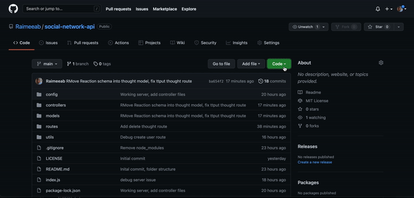
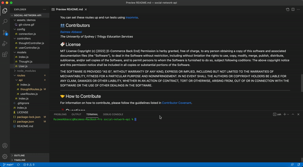
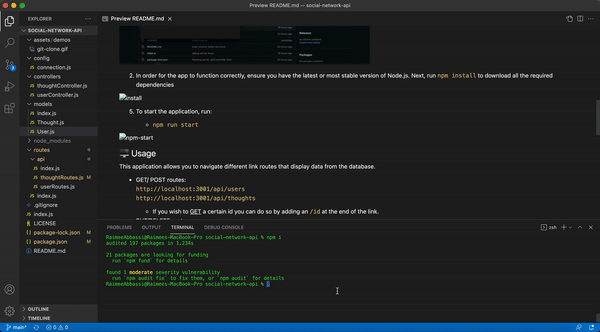

     

# Social Network API
---
## Table of Content 

* [Description](#description)
* [Technlogies](#technologies)
* [Usage](#usage)
* [Installation](#installation)
* [Contributors](#contributors)
* [License](#license)
* [Contribution](#contribution)
* [Questions](#questions)

## 📝 Description
This is a back end application for a Social Network created using a configured working Express API & mongoose ODM to interact with a mongoDB database. MongoDB is a popular choice for many social networks due to its speed with larger amounts of data and flexibility with unstructured data. Due to their prevalence, the aim of this application is to demonstrate my understanding of how to build and structure the API of these networks. 

## 🕹 Technologies used 
- JavaScript
- node.js
- Express.js
- MongoDB
- Mongoose
- Moment.js

## ⚙️ Installation 
*You can download a step-by-step tutorial [here]() by clicking on the `view raw` link*

1. Git clone this repository onto your local machine and navigate to the file on your terminal. *This can also be done by opening the file on Visual Studios and running it through the intergated terminal.*

2. In order for the app to function correctly, ensure you have the latest or most stable version of Node.js. Next, run `npm install` to download all the required dependencies

5. To start the application, run:

    - `npm run start`

## 🖥 Usage 
This application allows you to navigate different link routes that display data from the database. 

- GET/ POST routes:  
    `http://localhost:3001/api/users`  
    `http://localhost:3001/api/thoughts` 

     - If you wish to <u>GET</u> a certain id you can do so by adding an `/id` at the end of the link. 

- PUT/DELETE routes:  
    `http://localhost:3001/api/users/:id` 
    `http://localhost:3001/api/thoughts/:id`  

- POST/ DELETE routes:  
    `http://localhost:3001/api/users/:id/friends/:friendId`  
    `http://localhost:3001/api/thoughts/:id/reactions`  

    - The route above is used to <u>POST</u> a new reaction. If you wish to <u>DELETE</u> a certain  reaction you can do so by adding an `/id` at the end of the link. 

You can set these routes up and run tests using [insomnia](https://docs.insomnia.rest/).

## 👥 Contributors

*[Raimee Abbassi](https://github.com/Raimeeab)*  
*The Univserity of Sydney | Trilogy Education Services*  

## 🔖 License

MIT License
Copyright (c) [2022] [E-Commerce Back End]
Permission is herby granted, free of charge, to any person obtaining a copy of this software and associated documentation files (the "Software"), to deal in the Software without restriction, including without limiation the rights to use, copy, modify, merge, publish, distribute, sublicense, and/or sell copies of the Software, and to permit persons to whom the Software is furnished to do so, subject following coditions: 
The above copyright notice and this permission notice shall be included in all copies or substantial portions of the Software. 

THE SOFTWARE IS PROVIDED "AS IS", WITHOUT WARRANTY OF ANY KIND, EXPRESS OR IMPLIED, INCLUDING BUT NOT LIMITED TO THE WARRANTIES OF MECHANTABILITY, FITNESS FOR A PARTICULAR PURPOSE AND NONINFRINGEMENT. IN NO EVENT SHALL THE AUTHORS OR COPYRIGHT HOLDERS BE LIABLE FOR ANY CLAIM, DAMAGES OR OTHER LIABILITY, WHETHER IN AN ACTION OF CONTRACT, TORT OR OTHERWISE, ARISING FROM, OUT OF OR IN CONNECTION WITH THE SOFTWARE OR THE USE OF OTHER DEALINGS IN THE SOFTWARE.  

---

## 🤝 How to Contribute

For information on how to contribute, please follow the guidlelines listed in [Contributor Covenant](https://www.contributor-covenant.org/).

## ❓ Questions
If you have any questions, contact me via [email](raimee.abbassi@gmail.com). You can also find more of my work [here](https://github.com/Raimeeab).

